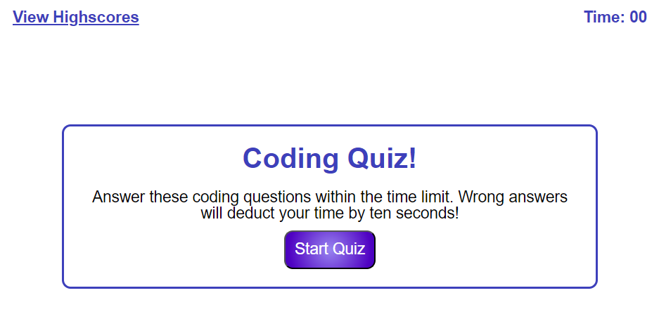
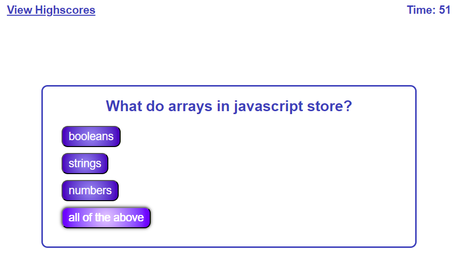
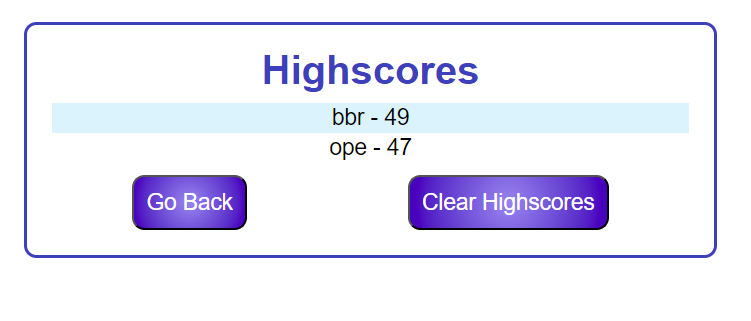

# Coding Quiz

## Description

Timed game using JavaScript with questions about coding basics. Uses Javascript for putting the high scores in local storage.

## Usage

Follow the URL to the deployed application.
Click the "Start Quiz" button to begin timer, and show questions.
After completing all questions, enter your initials and Click submit to be brought to the high scores page. There you can clear locally stored high scores, or go back to retake the quiz.

## URL

[Deployed URL](https://katsu-001.github.io/codingQuiz/)
[GitHub Repo](https://github.com/Katsu-001/codingQuiz)